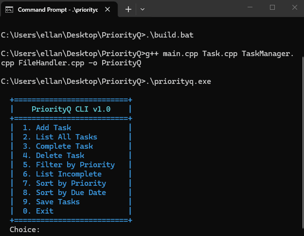

# PriorityQ

A command line task manager built in C++. Supports adding, sorting, filtering, and persisting tasks with color coded priority levels and a live progress tracker.



## Features

- Add tasks with a title, due date, and priority level (LOW / MEDIUM / HIGH)
- Color coded priority display — RED for HIGH, YELLOW for MEDIUM, GREEN for LOW
- Clean formatted table view with progress bar
- Sort tasks by priority or due date
- Filter by priority or view only incomplete tasks
- Tasks persist between sessions via file storage

## How to Build

Make sure you have g++ installed, then run:
```
g++ main.cpp Task.cpp TaskManager.cpp FileHandler.cpp -o PriorityQ
```

Then run it with:
```
.\PriorityQ.exe
```

## Tech Stack

- C++
- File I/O for data persistence
- ANSI escape codes for terminal colors
- Object oriented design across multiple classes

## Project Structure
```
PriorityQ/
├── main.cpp          - Entry point, UI, and menu logic
├── Task.h/.cpp       - Task data structure and priority enum
├── TaskManager.h/.cpp - Core task operations and sorting
├── FileHandler.h/.cpp - File save and load logic
└── README.md
```